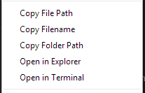

# Useful Context Menu Package for Atom

A set of useful context menu actions

## Available Actions

By now, I have added a few actions

#### Copy to Clipboard

- Copy File Path
- Copy Filename
- Copy Folder Path

#### Open In

- Open In File Manager
- Open In Terminal

## TODO List

- To be compatible with Mac OS X and Linux

## Participate

If you have any idea of other useful actions to be added, create an issue :)
